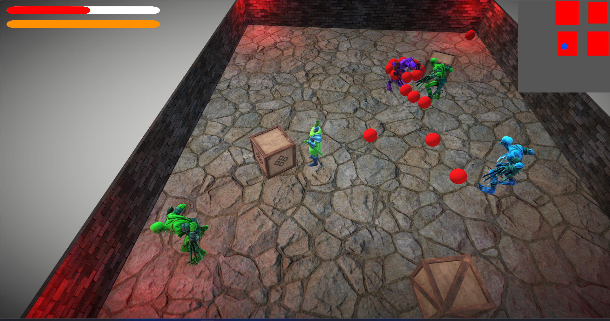
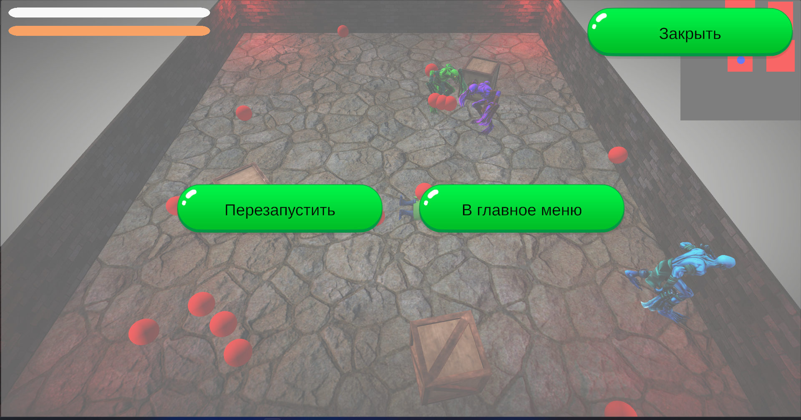
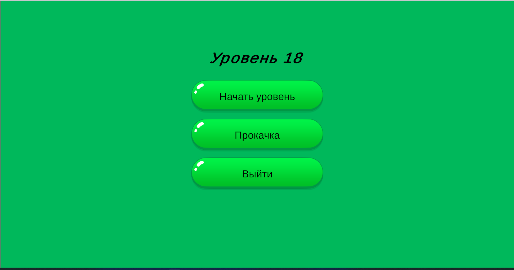
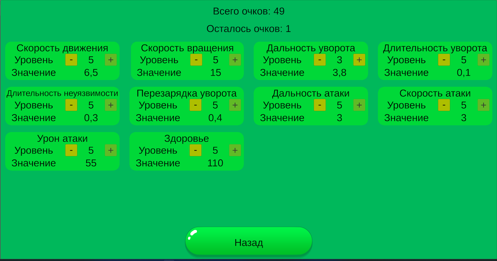
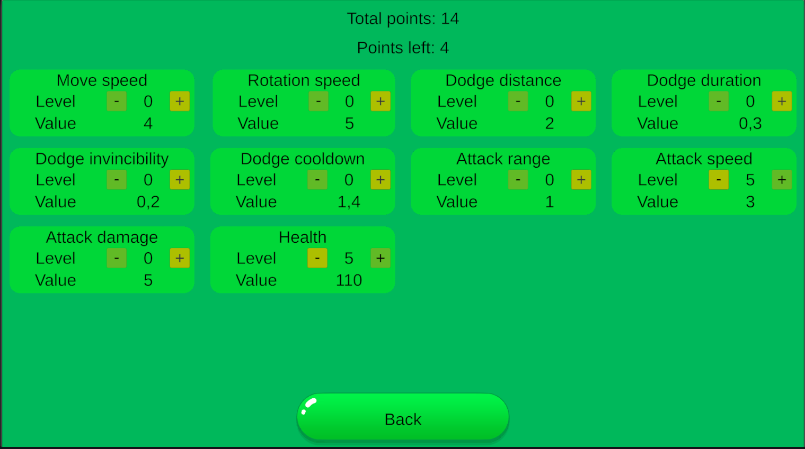
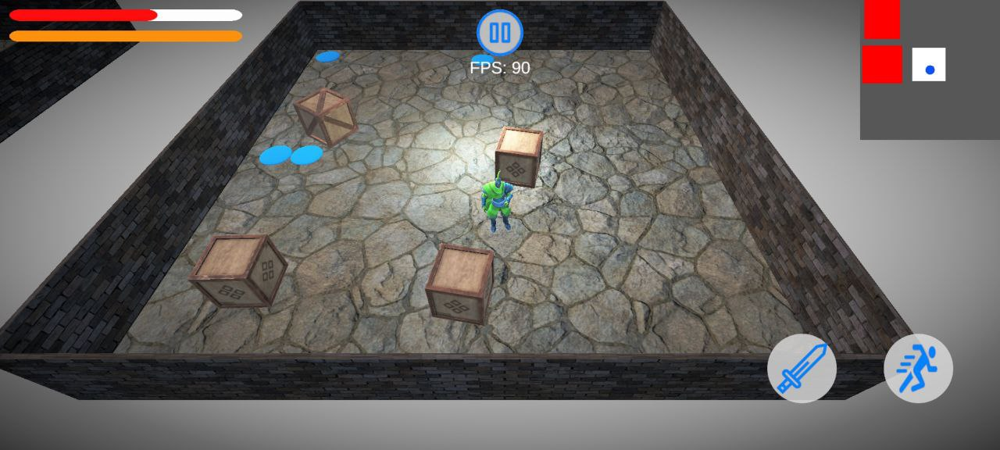

# Demo Project

## Видео
[Посмотреть геймплей](https://drive.google.com/file/d/1EicmYyfTRXG554MDnzfmSmhknebmdMIN/view?usp=sharing)

## Описание
Этот проект — динамичный экшен на Unity, в котором игроку предстоит сражаться с волнами врагов, зачищая комнаты на генерируемой карте уровня. Главная цель — уничтожить всех врагов в каждой комнате, избегая их атак и используя уклонение с временной неуязвимостью. При прохождении уровней характеристики врагов увеличиваются, а за уничтожение противников дают опыт, который можно использовать для прокачки параметров своего персонажа.

## Техническая часть

- **Unity** – движок
- **Zenject** – внедрение зависимостей
- **UniTask** – работа с асинхронностью
- **Addressables** – оптимизиция загрузки и управление ресурсами
- **DoTween** – анимации UI
- **Cinemachine** – управление камерой
- **URP** – используется управления графики под разные платформы
- **Localization** – поддержка нескольких языков (русский, английский)
- **Scriptable Object** – используется для хранения ассетов и управления конфигами
- **Input System** – ввод с устройств
- **Unity Ads** – реклама для монетизации
- **Оптимизация** – сжатие ассетов, оптимизация кода и UI

**Платформы:** Windows, Android  
**Используемые паттерны:** DI, ObjectPool, Factory, Observer, EntryPoint

## Скриншоты
### Игра

### Пауза

### Главное меню

### Меню прокачки

### Локализация

### Android

